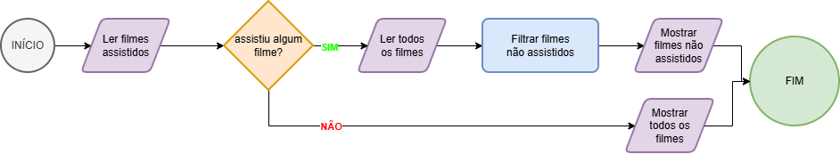

# CineApp - Projeto 1 do Upskill

## Autores

- Gabriel: [@devgabrielpanta](https://www.github.com/devgabrielpanta)
- Antonio: [@antoniocfigueira](https://www.github.com/antoniocfigueira)

## Descrição

- Aplicação simples para gerir a tua coleção de filmes e o que queres ver a seguir.
- Mantém três fontes de dados: a coleção de filmes, a lista de usuários e um log de atividades do utilizador.

### Estruturas de dados escolhidas e justificação da adequação

- Filmes: Preferimos criar um objeto que centraliza as propriedades relacionadas a um filme, desde os elementos base (título/descrição) até objetos aninhados, como por exemplo a avaliação. Dessa forma, quando precisamos aceder a algo relacionado a um determinado filme, acreditamos que fica mais acessível.

- Usuários: Criamos um objeto user para cada utilizador, contendo propriedades-chave, como a lista de filmes que esse utilizador assistiu. Com isso, conseguimos ser mais objetivos nas funções que respondem às interações dos usuários.

- Logs: Mantivemos separada uma lista de objetos que sintetizam as ações do utilizador, com o objetivo de proporcionar insights mais práticos aos administradores.

### Descrição das 3 operações escolhidas e justificação da adequação
- Pesquisar filme: permite ao utilizador encontrar rapidamente um filme específico (por título ou género), tornando a navegação mais eficiente e facilitando o acesso às informações desejadas.
- Adicionar a lista: permite guardar filmes de interesse numa lista pessoal, oferecendo uma experiência mais organizada e personalizada ao utilizador.
- Remover da lista: permite ao utilizador retirar filmes que já não deseja manter, garantindo que a lista permaneça limpa, atualizada e relevante.

### Funcionalidades do sistema:

- Adicionar/remover filmes.
- Editar a lista de géneros de filmes manualmente.
- Adicionar utilizadores.
- Monitorizar as atividades dos utilizadores por um log.
- Gerar relatórios.

### Funcionalidades para os utilizadores:

- Assistir um filme.
- Adicionar/remover um filme da coleção (lista).
- Avaliar um filme.
- Pesquisar por género.
- Pesquisar por título.
- Obter lista de filmes pendentes (não vistos).

## Passos para correr os ficheiros

- main.js: script central que importa as principais funções do sistema e faz mock dos dados.
- users.js: ficheiro que centraliza as funções relacionadas aos utilizadores.
- filmes.js: ficheiro que centraliza as funções relacionadas aos filmes.
- globals.js: variáveis compartilhadas entre os demais ficheiros, basicamente são lista de objetos.
- logs.js: funções que gerenciam as atividades dos utilizadores e são partilhadas com os demais ficheiros/
- reports.js: chamadas de console.(...) que exibiem descrição seguida dos resultados - maior parte em tabela.

## Itens complementares

### Caça aos bugs

Documentação que ilustra como os autores identificaram e lideram com problemas (folder "caca-bug`).
➡️ [Acessar pasta "caca-bug"](./caca-bug/)

### Fluxogramas

#### Listar pendentes


Ilustra o comportamento da função a seguir, responsável por listar os filmes do sistema que um determinado usuário ainda não assistiu:

```javascript
function filmesPendentes(user) {
  return filmes.filter((filme) => !user.visualizados.includes(filme.titulo));
}
```

#### Média de avaliações


Ilustra o comportamento da função a seguir, responsável por calcular o rating de um filme com base nos reviews:

```javascript
function atualizarAvalicao(movie) {
  let avaliacaoCount = 0;
  let avaliacaoTotal = 0;
  let avaliacaoRating = 0;

  const currentReviews = movie.avaliacao.reviews;
  if (currentReviews.length > 0) {
    avaliacaoCount = currentReviews.length;
    avaliacaoTotal = currentReviews.reduce(
      (acc, review) => acc + review.rating,
      0
    );
    avaliacaoRating = avaliacaoTotal / avaliacaoCount;
  }

  filmes.map((filme) =>
    filme.titulo !== movie.titulo
      ? filme
      : {
          ...movie,
          avaliacao: {
            ...filme.avaliacao,
            count: avaliacaoCount,
            rating: avaliacaoRating,
          },
        }
  );
}
```
