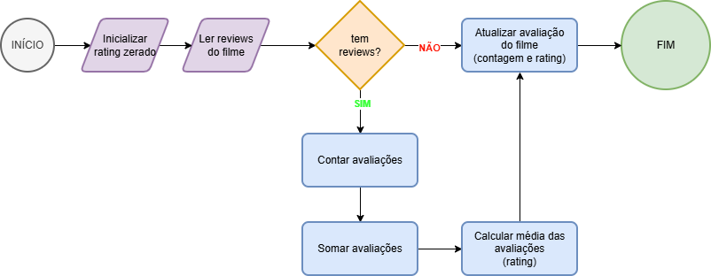

# CineApp - Projeto 1 do Upskill
## Autores
- [@devgabrielpanta](https://www.github.com/devgabrielpanta)
- [@antoniocfigueira](https://www.github.com/antoniocfigueira)

## Fluxogramas

### Média de avaliações

Ilustra o comportamento da função a seguir, responsável por calcular o rating de um filme com base nos reviews:
```javascript
function atualizarAvalicao(movie) {
  let avaliacaoCount = 0;
  let avaliacaoTotal = 0;
  let avaliacaoRating = 0;

  const currentReviews = movie.avaliacao.reviews;
  if (currentReviews.length > 0) {
    avaliacaoCount = currentReviews.length;
    avaliacaoTotal = currentReviews.reduce(
      (acc, review) => acc + review.rating,
      0
    );
    avaliacaoRating = avaliacaoTotal / avaliacaoCount;
  }

  filmes.map((filme) =>
    filme.titulo !== movie.titulo
      ? filme
      : {
          ...movie,
          avaliacao: {
            ...filme.avaliacao,
            count: avaliacaoCount,
            rating: avaliacaoRating,
          },
        }
  );
}
```