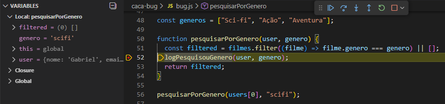
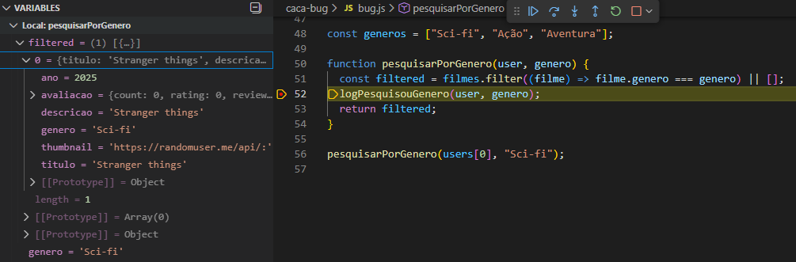
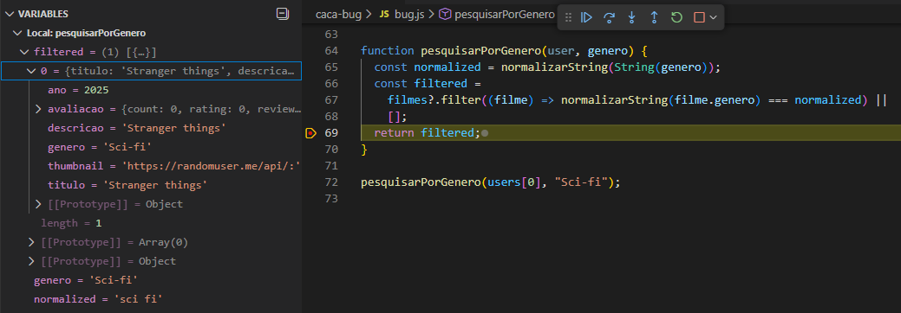
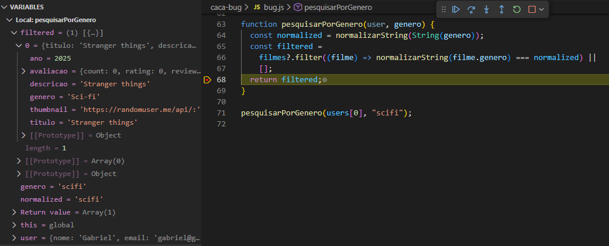
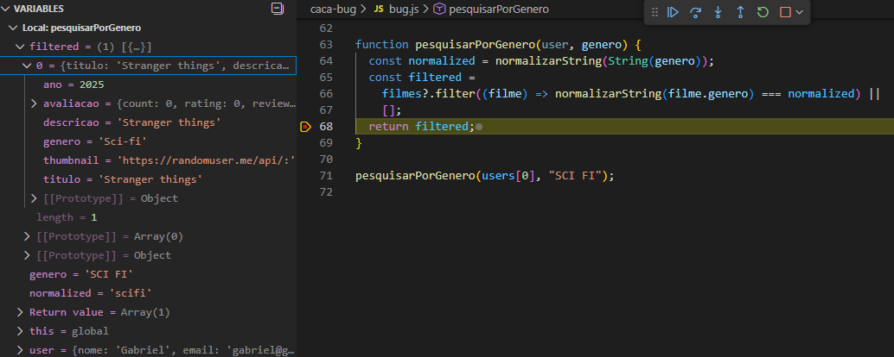

# CAÇA AO BUG

### Correção aplicada com normalização de strings:

Este documento descreve o bug encontrado na função pesquisarPorGenero, o processo de depuração e a solução implementada utilizando uma função de normalização mais robusta.

---

## 🚨 Problema

### A função pesquisarPorGenero comparava o gênero informado pelo usuário diretamente com o gênero armazenado nos filmes, resultando em falhas quando havia:

- diferenças de acentuação
- letras maiúsculas/minúsculas
- hífens ou barras
- múltiplos espaços

```javascript
// Géneros default
const generos = ["Sci-fi", "Ação", "Aventura"];

function pesquisarPorGenero(user, genero) {
  // Filtra a lista de filmes com base no género
  const filtered = filmes.filter((filme) => filme.genero === genero) || [];

  // Gera log da atividade realizada pelo utilizador
  logPesquisouGenero(user, genero);

  // Retorna a lista filtada
  return filtered;
}

// Chama a função passando usuário e género
pesquisarPorGenero(users[0], "scifi");
```

### No caso acima, era suposto retornar os filmes com o género "Sci-fi" entretanto pelo debug constatamos que a lista ficava vazia:

```javascript
pesquisarPorGenero(users[0], "Sci-fi");
```



---

### Ao testarmos com a escrita correta, evidenciamos que a lista trazia resultados e constatamos que havia um erro no sistema pois o formato da string era um viés não tratado:



---

## 🤖 Solução

### A solução implementada foi normalizar tanto o género default da lista (propriedade do objeto filme), quanto o género que chegava na função pelo suposto input do usuário.

---

Para tanto, criamos a função normalizarString com ajuda do ChatGPT que realiza as seguintes normalizações:

```javascript
// Função que recebe uma string (texto) e retorna ela normalizada
function normalizarString(texto) {
  return (
    String(texto)
      // separa acentos
      .normalize("NFD")

      // remove acentos
      .replace(/[\u0300-\u036f]/g, "")

      // remove pontuação que atrapalha comparações (hífen, barras, parênteses, etc.)
      .replace(/[^\p{L}\p{N}\s]/gu, " ")

      // converte para minúscula
      .toLowerCase()

      // remove TODOS os espaços
      .replace(/\s+/g, "")

      // remove múltiplos espaços
      .trim()
  );
}
```

---

Com isso, alteramos a função pesquisarPorGenero para normalizar os géneros antes de filtrar a lista:

```javascript
function pesquisarPorGenero(user, genero) {
  // Normaliza o género que foi passado para a função
  const normalized = normalizarString(String(genero));

  // Normaliza o género do filme dentro do filter com o normalizarString(filme.genero)
  const filtered =
    filmes?.filter((filme) => normalizarString(filme.genero) === normalized) ||
    [];

  // Gera log da atividade realizada pelo utilizador
  logPesquisouGenero(user, genero);

  // Retorna a lista filtrada
  return filtered;
}
```

## ✅ Resultados

```javascript
pesquisarPorGenero(users[0], "Sci-fi");
```



---

```javascript
pesquisarPorGenero(users[0], "scifi");
```



---

```javascript
pesquisarPorGenero(users[0], "SCI FI");
```


